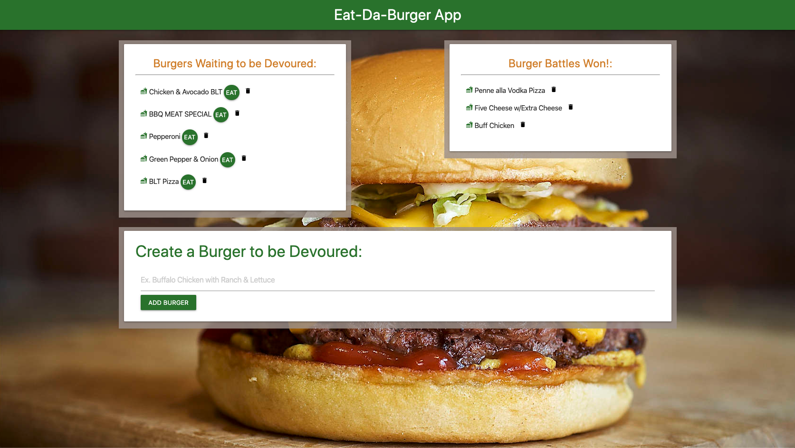

# Eat Da Burger App

## Project Description
### Hungry??

### Like Burgers??

Eat-Da-Burger! is a wish list of burgers that the user would like to eat. The application allows the user to input a name of a burger that they wish to devour and add it to their list! Once they have eaten their dream burger, they can move it to the list of "Burger Battles Won" by clicking the EAT button next to the burger's name. At any time, the user can remove burgers from either list by clicking the trashcan next to the burger's name.

Whenever a user submits a burger's name, the app will display the burger on the left side of the page -- <i>Waiting to be Devoured.</i>

Each burger in the waiting area also has a "Devour it!" button. When the user clicks it, the burger will move to the right side of the page -- list of <i>Burger Battles Won!</i>

## Built With
* Node.js
* Express
* MySQL
* Handlebars
* Custom ORM

## Preview

## Got Questions? 
### Ask Me:
* GitHub Profile: https://github.com/lalliere
* My Email: emilylallier@yahoo.com 
